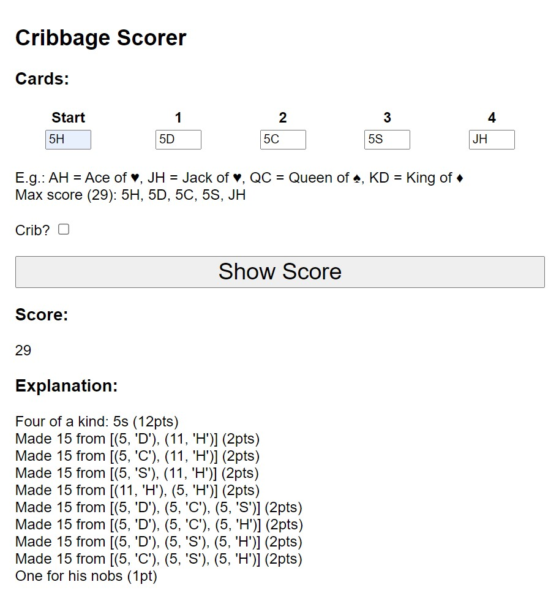

# Cribbage Service

Cribbage Service is an API to support the [Cribbage scoring engine](https://github.com/phoughton/cribbage_scorer) for the classic card game.

Now available as a ChatGPT Plugin!

### To run the tests:
```bash
python -m pytest
```

### Quick install using pip & requirements.txt (recommended)
Create a virtual environment and type this pip command at the command line. 
```bash
pip install -r requirements.txt
```

### Running the app
The below commands will run the server and will output a URL you can use to access it.

#### Windows 10/11:
```bash
set FLASK_APP=app
flask run
```

#### Linux/Unix/Mac/Bash (inc WSL):
```bash
export FLASK_APP=app
flask run
```
###  Deployment
This repo is also set up to store a copy of the app as a docker container to the Azure container registry and deploy a copy of that container to Azure.

### What does it do?

As well as providing a full API for scoring cribbage games, the server also has a simple UI for manual investigation & use.


